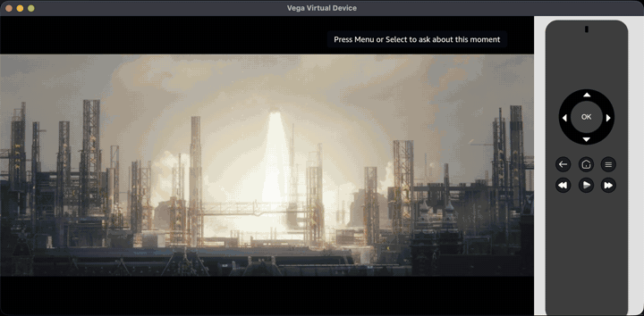
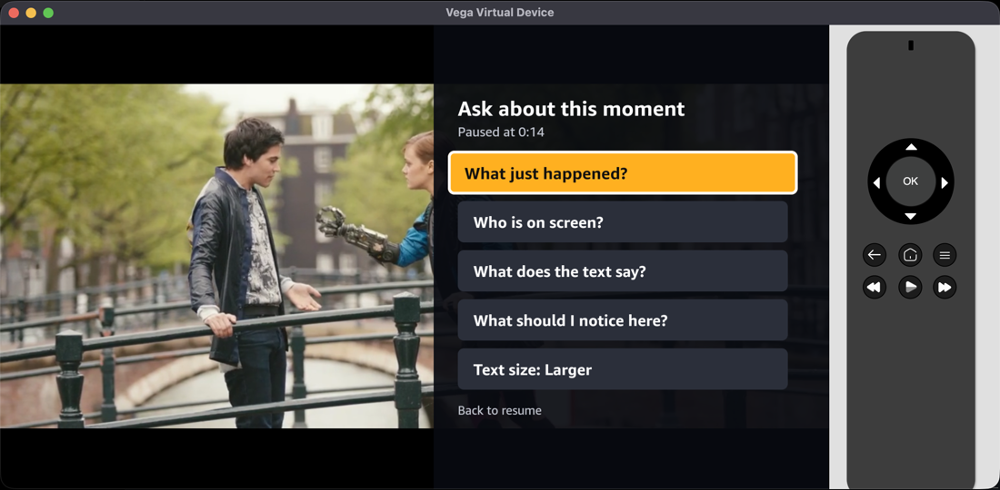
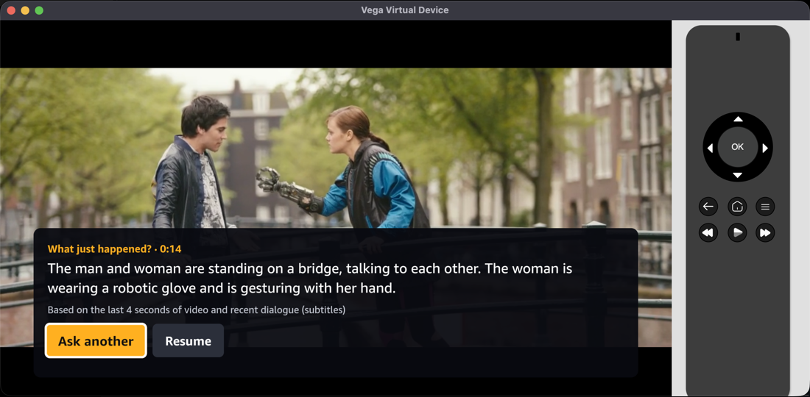

# Moment

**Pause your TV and ask what just happened.** Moment is a Fire TV app (Vega OS) where you press **Menu** while a video plays, the video pauses, and you pick a question about the current moment: "What just happened?", "Who is on screen?", "What does the text say?", "What should I notice here?". A short answer appears on screen, based on the last few seconds of video and the dialogue around that moment, with an honest "I'm not sure" when the frames don't show it.



| Ask | Answer |
|---|---|
|  |  |

From the answer you can **ask another** question about the same moment, **replay the last 10 seconds**, or resume. A start screen lets you **pick a clip**. A fifth question, **"What did they just say?"**, quotes the clip's last subtitle lines word for word (no AI call, no cost) and says honestly when a clip has no subtitles; it may help people who are deaf or hard of hearing but has not been tested with them. When you open the question panel, the preset questions are **pre-answered in the background**, so a question asked a few seconds later appears almost instantly.

Moment is **AI-enhanced viewing**: useful when you looked away, are multitasking, or can't read small on-screen text. It has screen-reader labels, but it has **not** been tested with blind or low-vision viewers, and we make no claim that it is built for them.

Built for the Amazon Developer Hackathon (Fire TV track, AWS Builder mini challenge). Inference runs in the cloud (Amazon Bedrock), not on the TV.

## How it works

```
Fire TV app (Vega OS, React Native 0.83) on the Vega Virtual Device
  Menu -> read currentTime -> pause -> POST /ask {clipId, timestamp, question}
        |  http://10.0.2.2:8787   (the emulator's address for the host Mac)
Node backend (127.0.0.1:8787, TypeScript, Node 24)
  window: 5 frames from the last 4 s  +  dialogue from the last 10 s (never future dialogue)
  prompt v3 -> answer cache + in-flight join -> retry (4 s + 3 s attempts) -> cost guard ($130 hard stop)
  prefetch: opening the panel pre-answers the 4 presets (queue, concurrency 4, cancelled on close)
        |  Converse API (AWS SDK for JavaScript v3)
Amazon Bedrock, us-east-1, amazon.nova-lite-v1:0 (image + text in, text out)

Offline: ffmpeg -> clips/<id>/{clip.mp4, frames/*.jpg (2 fps, 512 px wide), index.json, subs.srt}
```

The technical core is **temporal context selection**: which frames and which subtitle lines to send for a given pause, chosen by an evaluation harness rather than by guesswork (see Evaluation).

## Quick start (macOS, Apple Silicon)

Tested on macOS 27, Node 24.4.1 and Vega SDK 0.24.12112. Stub mode needs no AWS account.

1. **Tools.** `softwareupdate --install-rosetta --agree-to-license`, then `brew install node ffmpeg watchman`. Keep the project **outside** Documents/Desktop/Downloads, or allow the macOS prompt for watchman, otherwise the app build can hang silently (friction log #6).
2. **Vega SDK and emulator.** Install the SDK from https://developer.amazon.com/docs/vega/0.24/install-vega-sdk.html (close VS Code first; run the installer in a normal terminal window), then `source ~/vega/env` and `vega virtual-device start --timeout 600`.
3. **Clips.** From the repo root: `node backend/scripts/fetch-clips.ts` (downloads and cuts the six excerpts; needs network), then `node backend/scripts/prepare-app-clips.ts` (bundles all six into the app, about 40 MB, and creates the picker's poster frames).
4. **Backend, stub mode (no AWS).** `cd backend && npm install && npm start`; check `curl 127.0.0.1:8787/health`. Answers in stub mode are placeholders.
5. **Backend, live mode.** Configure an AWS profile with `bedrock:InvokeModel` only (never commit credentials), then `AWS_PROFILE=<profile> AWS_REGION=us-east-1 BEDROCK_MODE=live npm start`. A brand-new AWS account can be blocked from Bedrock for up to 2 hours (friction log #12). Every live call is logged to `eval/cost_log.csv` and refused above $130.
6. **App.** `cd app && npm install && npm run build:app && vega run-app build/aarch64-release/moment-app_aarch64.vpkg com.anson.moment.main -d VirtualDevice`.
7. **Use it.** In the emulator window the keyboard is the remote. On the start screen, arrows move and **Enter** starts a clip. While a clip plays: **F2 = Menu** (or Enter = Select) opens the question panel, arrows move, **Enter** picks; on the answer card, Enter presses the focused button (Ask another, Replay 10 s, Resume), **Esc = Back** resumes (Back while playing returns to the clip picker), **F4 = Play/Pause**. In macOS System Settings > Keyboard, turn on "Use F1, F2, etc. keys as standard function keys".

## Evaluation

We compared context configurations on 50 questions over six clips (15 "dev" questions used to design the prompt, 35 "test" questions run once per finalist). Questions cover action, identity/appearance, on-screen text, counting/spatial and "not visible" (where "I'm not sure" is the right answer).

**Test split (35 questions), `eval/results/summary-test.md`:**

| Config | Accuracy | Hallucinated | Honest abstention on "not visible" | p50 / p95 latency | Cost per question |
|---|---|---|---|---|---|
| **c7-v3 (default)** | **73%** | 3% | 91% | 2.5 s / 3.2 s | $0.00030 |
| c4: 5 frames + subtitles (earlier default) | 61% | 3% | 82% | 2.6 s / 4.1 s | $0.00030 |
| c8: v3 with an 8 s window | 69% | 0% | 91% | 2.4 s / 3.7 s | $0.00030 |
| c6: Nova Pro, same context as c4 | 69% | 3% | 82% | 2.6 s / 5.0 s | $0.00389 |

Paired by question, the default beat c4 on 5 questions and lost none (30 ties). Accuracy is (correct + 0.5 x partial) / graded. Honest numbers about the numbers:
- **Dev split** (used to design prompt v3, so optimistic), `eval/results/summary-dev.md`: 1 frame 53%, 3 frames 63%, 5 frames 70%, 5 frames + subtitles 73%, 8 s window 77%, Nova Pro 70%, prompt v3 87% (after the owner spot-check below).
- **Small samples:** 4 to 11 questions per category, and 2 of 15 answers changed between two identical runs even at temperature 0. Treat differences of 1-2 questions as noise.
- **Grading:** all answers were graded by an automated assistant against expected answers that the project owner confirmed by watching the clips. To check the grader, the project owner re-graded a stratified sample of 15 answers (5 I had called correct, 5 partial, 3 wrong, 2 hallucinated) blind to my grades: the same grade on 8 of 15 (53%), within one grade level on 14 of 15, and the same acceptable-or-not call (correct/partial vs wrong/hallucinated) on 13 of 15. The owner was stricter than the assistant on 5 answers and more lenient on 2, and called none of the answers hallucinated (I had called two), so treat the assistant-graded accuracy as somewhat optimistic. The owner's grades replace mine for those 15 answers (`eval/grades/manual.csv`); only the development-split table changed (the locked test, holdout and dialogue numbers did not).
- One Nova Pro request of 35 was throttled by Bedrock and is left ungraded.

**Second, independent check (held-out, never used for tuning).** After the default was chosen, 36 new questions were written at new moments (12 for tuning, 24 locked). The unchanged default scored **63% overall on the 24 locked questions** (action 54% on 12, identity 50% on 3, on-screen text 100% on 3, counting 67% on 3, "not visible" 67% on 3), 4% hallucinated, p50 2.4 s / p95 3.5 s with the production timeouts, 2 of 24 answers differing between two identical runs (`eval/results/summary-holdout2.md`). That is lower than the 73% on the first test split; both samples are small, and the new one is half action questions, the weakest category.

**An attempt to improve action answers did not work.** Three ideas for "What just happened?" (a "what changed" prompt, 8 frames over 8 s, and sending the last 4 s as a video clip) were tried on the development questions with production timeouts; none beat the default (55% vs 45% / 36% / 36% on 11 items), and two added timeouts or invented actions, so the default was kept (`eval/results/action-experiments.md`).

**Latency with and without prefetch** (live backend, `node backend/scripts/measure-prefetch.ts`). Over three runs (20 moments each; `eval/results/prefetch-conc4.json`, `prefetch-five-presets.json`, `prefetch-retry-fix.json`) a cold answer took a median of 2.4-2.9 s (95th percentile 3.4-3.7 s), and a question asked 3 s after the panel opened took a median of 2-30 ms (95th percentile 0.8-4.2 s); between half and almost all answers came straight from prefetch and the rest joined a call still running (or, once, made its own). A one-time retry for failed background calls was added after the second run; it did not trigger in the third run (no failed calls), so its effect is untested, and the better tail in that run may just be run-to-run variation. One cold request timed out in the third run. At concurrency 2 the median was 1.2 s. Asking immediately joins the call in flight (no second model call). Prefetch costs about $0.0012 per panel open (4 calls). No throttling in about 600 prefetch calls across the runs, including bursts of rapid opens; 1 of 250 calls in the second run failed (not a throttle; the cause was not logged, so failures are now logged).

**Dialogue question.** "What did they just say?" is answered from the subtitles with no model call. On 22 new owner-confirmed questions it was exact (11 of 11 on the development split, 11 of 11 on the locked split, each including 3 honest "no subtitles / no dialogue" cases), and a Nova Lite alternative that also looked at 2 frames was worse (88% vs 100%, dropped the newest line once), so it was not used. Because the answer copies the subtitle text this mainly checks the window rule and the honest no-subtitles answers, not model skill; details and caveats in `eval/results/dialogue-experiments.md`. Not tested with real audio or with deaf or hard-of-hearing viewers.

Total live spend for everything above: **1392 live calls, $0.5478** (`node backend/scripts/spend.ts`, from `eval/cost_log.csv`).

Reproduce: `AWS_PROFILE=<profile> AWS_REGION=us-east-1 node backend/scripts/run.ts c7-v3 --split test`, then `node backend/scripts/grade-page.ts <runDir>` (a blind grading page), `node backend/scripts/grade-import.ts <grades.csv>` and `node backend/scripts/summarize.ts <runDirs>`. Raw answers and the grades we used are committed under `eval/`.

## Tests

`cd backend && npm test` (59 tests: window selection, subtitles, prompt, retry and timeouts, cache, prefetch and in-flight joining, per-question overrides, cost guard, eval statistics) and `cd app && npm test` (15 tests: contrast ratios, spoken time, answer note, replay target, bundled clips).

## Limitations

- Action questions ("What just happened?") are the weakest category (63% on the first test split, 4 questions; 54% on the second held-out check, 12 questions); answers are often right about the scene but miss or invent what changed. Three attempted fixes did not help.
- The "What does the text say?" question can return text that was on screen a few seconds earlier, and counting can include people from earlier frames in the window.
- Pre-cut CC-BY clips only: frames are extracted offline and the backend runs on the development Mac, not a live stream or a real TV.
- Audio is not analysed: answers use frames and subtitles only, all clips are silent (soundtrack licences), and the dialogue question needs a subtitle file (only two of the six clips have one). Transcribing speech or describing sounds would need a transcription service or model and audio we may redistribute; it is future work.
- Screen-reader labels exist; actual VoiceView speech on the emulator is not verified (friction log #18). User tests with outside viewers have a script (`docs/USER_TESTS.md`); results are added there only if the sessions are run.
- Identity questions describe appearance; the model is told not to identify real people from faces.

## Repository map

`app/` Vega app, `backend/` API, window selection, prompt, Bedrock client and eval scripts (with tests), `clips/` manifest, subtitles and indexes, `eval/` questions, configs, results, grades and cost log, `docs/` progress, decisions, friction log, product feedback, feature requests, user tests.

## Licenses

Code: MIT (`LICENSE`). Clips: see `clips/NOTICE.md` (Blender Foundation films under CC-BY, a public-domain 1906 film; all audio removed). Tears of Steel, Sintel, Big Buck Bunny, Spring and Caminandes: (CC) Blender Foundation.
